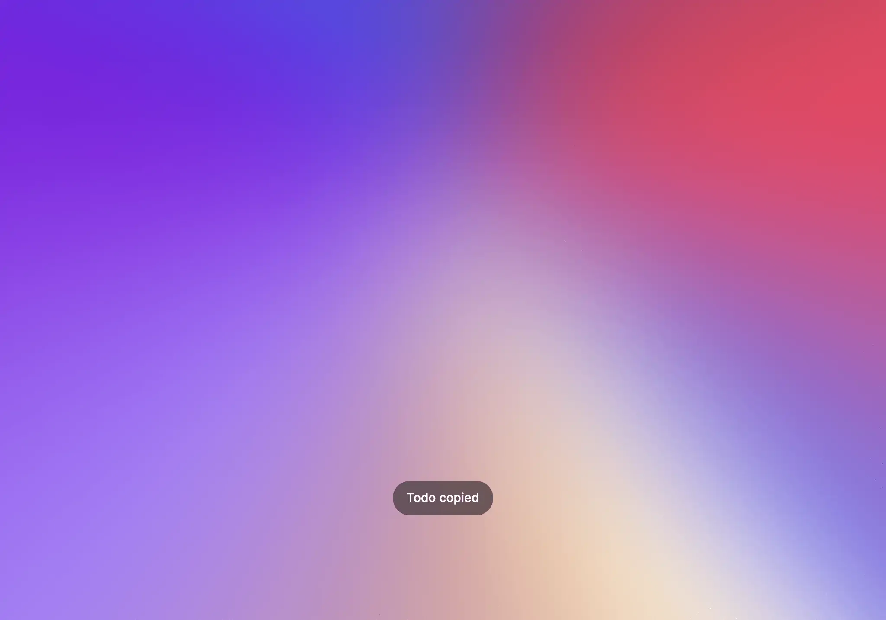

# HUD

When the user takes an action that has the side effect of closing Raycast (for example when copying something in the [Clipboard](../clipboard.md)), you can use a HUD to confirm that the action worked properly.



## API Reference

### showHUD

A HUD will automatically hide the main window and show a compact message at the bottom of the screen.

#### Signature

```typescript
async function showHUD(
  title: string,
  options?: { clearRootSearch?: boolean; popToRootType?: PopToRootType }
): Promise<void>;
```

#### Example

```typescript
import { showHUD } from "@raycast/api";

export default async function Command() {
  await showHUD("Hey there 👋");
}
```

`showHUD` closes the main window when called, so you can use the same options as `closeMainWindow`:

```typescript
import { showHUD } from "@raycast/api";

export default async function Command() {
  await showHUD("Hey there 👋", { clearRootSearch: true, popToRootType: PopToRootType.Immediate });
}
```

#### Parameters

| Name | Description | Type |
| :--- | :--- | :--- |
| title<mark style="color:red;">*</mark> | The title that will be displayed in the HUD. | <code>string</code> |
| options | Can be used to control the behaviour after closing the main window. | <code>Object</code> |
| options.clearRootSearch | Clears the text in the root search bar and scrolls to the top | <code>boolean</code> |
| options.popToRootType | Defines the pop to root behavior ([PopToRootType](../window-and-search-bar.md#poptoroottype)); the default is to to respect the user's "Pop to Root Search" preference in Raycast | <code>[PopToRootType](../window-and-search-bar.md#poptoroottype)</code> |

#### Return

A Promise that resolves when the HUD is shown.
