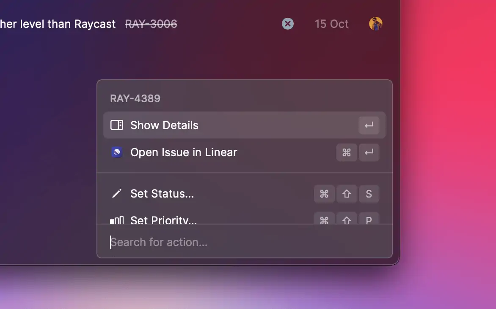

# Action Panel



## API Reference

### ActionPanel

Exposes a list of [actions](./actions.md) that can be performed by the user.

Often items are context-aware, e.g., based on the selected list item. Actions can be grouped into semantic
sections and can have keyboard shortcuts assigned.

The first and second action become the primary and secondary action. They automatically get the default keyboard shortcuts assigned.
In [List](./list.md), [Grid](./grid.md), and [Detail](./detail.md), this is `↵` for the primary and `⌘` `↵` for the secondary action. In [Form](./form.md) it's `⌘` `↵` for the primary and `⌘` `⇧` `↵` for the secondary.
Keep in mind that while you can specify an alternative shortcut for the primary and secondary actions, it won't be displayed in the Action Panel.

#### Example

```typescript
import { ActionPanel, Action, List } from "@raycast/api";

export default function Command() {
  return (
    <List navigationTitle="Open Pull Requests">
      <List.Item
        title="Docs: Update API Reference"
        subtitle="#1"
        actions={
          <ActionPanel title="#1 in raycast/extensions">
            <Action.OpenInBrowser url="https://github.com/raycast/extensions/pull/1" />
            <Action.CopyToClipboard
              title="Copy Pull Request URL"
              content="https://github.com/raycast/extensions/pull/1"
            />
          </ActionPanel>
        }
      />
    </List>
  );
}
```

#### Props

| Prop | Description | Type | Default |
| :--- | :--- | :--- | :--- |
| children | Sections or Actions. If Action elements are specified, a default section is automatically created. | <code>[ActionPanel.Children](action-panel.md#actionpanel.children)</code> | - |
| title | The title displayed at the top of the panel | <code>string</code> | - |

### ActionPanel.Section

A group of visually separated items.

Use sections when the [ActionPanel](#actionpanel) contains a lot of actions to help guide the user to related actions.
For example, create a section for all copy actions.

#### Example

```typescript
import { ActionPanel, Action, List } from "@raycast/api";

export default function Command() {
  return (
    <List navigationTitle="Open Pull Requests">
      <List.Item
        title="Docs: Update API Reference"
        subtitle="#1"
        actions={
          <ActionPanel title="#1 in raycast/extensions">
            <ActionPanel.Section title="Copy">
              <Action.CopyToClipboard title="Copy Pull Request Number" content="#1" />
              <Action.CopyToClipboard
                title="Copy Pull Request URL"
                content="https://github.com/raycast/extensions/pull/1"
              />
              <Action.CopyToClipboard title="Copy Pull Request Title" content="Docs: Update API Reference" />
            </ActionPanel.Section>
            <ActionPanel.Section title="Danger zone">
              <Action title="Close Pull Request" onAction={() => console.log("Close PR #1")} />
            </ActionPanel.Section>
          </ActionPanel>
        }
      />
    </List>
  );
}
```

#### Props

| Prop | Description | Type | Default |
| :--- | :--- | :--- | :--- |
| children | The item elements of the section. | <code>[ActionPanel.Section.Children](action-panel.md#actionpanel.section.children)</code> | - |
| title | Title displayed above the section | <code>string</code> | - |

### ActionPanel.Submenu

A very specific action that replaces the current [ActionPanel](#actionpanel) with its children when selected.

This is handy when an action needs to select from a range of options. For example, to add a label to a GitHub pull request or an assignee to a todo.

#### Example

```typescript
import { Action, ActionPanel, Color, Icon, List } from "@raycast/api";

export default function Command() {
  return (
    <List navigationTitle="Open Pull Requests">
      <List.Item
        title="Docs: Update API Reference"
        subtitle="#1"
        actions={
          <ActionPanel title="#1 in raycast/extensions">
            <ActionPanel.Submenu title="Add Label">
              <Action
                icon={{ source: Icon.Circle, tintColor: Color.Red }}
                title="Bug"
                onAction={() => console.log("Add bug label")}
              />
              <Action
                icon={{ source: Icon.Circle, tintColor: Color.Yellow }}
                title="Enhancement"
                onAction={() => console.log("Add enhancement label")}
              />
              <Action
                icon={{ source: Icon.Circle, tintColor: Color.Blue }}
                title="Help Wanted"
                onAction={() => console.log("Add help wanted label")}
              />
            </ActionPanel.Submenu>
          </ActionPanel>
        }
      />
    </List>
  );
}
```

#### Props

| Prop | Description | Type | Default |
| :--- | :--- | :--- | :--- |
| title<mark style="color:red;">*</mark> | The title displayed for submenu. | <code>string</code> | - |
| autoFocus | Indicates whether the ActionPanel.Submenu should be focused automatically when the parent ActionPanel (or Actionpanel.Submenu) opens. | <code>boolean</code> | - |
| children | Items of the submenu. | <code>[ActionPanel.Submenu.Children](action-panel.md#actionpanel.submenu.children)</code> | - |
| filtering | Toggles Raycast filtering. When `true`, Raycast will use the query in the search bar to filter the  items. When `false`, the extension needs to take care of the filtering.    You can further define how native filtering orders sections by setting an object with a `keepSectionOrder` property:  When `true`, ensures that Raycast filtering maintains the section order as defined in the extension.  When `false`, filtering may change the section order depending on the ranking values of items. | <code>boolean</code> or <code>{ keepSectionOrder: boolean }</code> | - |
| icon | The icon displayed for the submenu. | <code>[Image.ImageLike](icons-and-images.md#image.imagelike)</code> | - |
| isLoading | Indicates whether a loading indicator should be shown or hidden next to the search bar | <code>boolean</code> | - |
| onOpen | Callback that is triggered when the Submenu is opened.    This callback can be used to fetch its content lazily:  ```js  function LazySubmenu() {    const [content, setContent] = useState(null)      return (      <ActionPanel.Submenu onOpen={() => fetchSubmenuContent().then(setContent)}>        {content}      </ActionPanel.Submenu>    )  }  ``` | <code>() => void</code> | - |
| onSearchTextChange | Callback triggered when the search bar text changes. | <code>(text: string) => void</code> | - |
| shortcut | The keyboard shortcut for the submenu. | <code>[Keyboard.Shortcut](../keyboard.md#keyboard.shortcut)</code> | - |
| throttle | Defines whether the `onSearchTextChange` handler will be triggered on every keyboard press or with a delay for throttling the events.  Recommended to set to `true` when using custom filtering logic with asynchronous operations (e.g. network requests). | <code>boolean</code> | - |

## Types

### ActionPanel.Children

```typescript
ActionPanel.Children: ActionPanel.Section | ActionPanel.Section[] | ActionPanel.Section.Children | null
```

Supported children for the [ActionPanel](#actionpanel) component.

### ActionPanel.Section.Children

```typescript
ActionPanel.Section.Children: Action | Action[] | ReactElement<ActionPanel.Submenu.Props> | ReactElement<ActionPanel.Submenu.Props>[] | null
```

Supported children for the [ActionPanel.Section](#actionpanel.section) component.

### ActionPanel.Submenu.Children

```typescript
ActionPanel.Children: ActionPanel.Section | ActionPanel.Section[] | ActionPanel.Section.Children | null
```

Supported children for the [ActionPanel.Submenu](#actionpanel.submenu) component.
